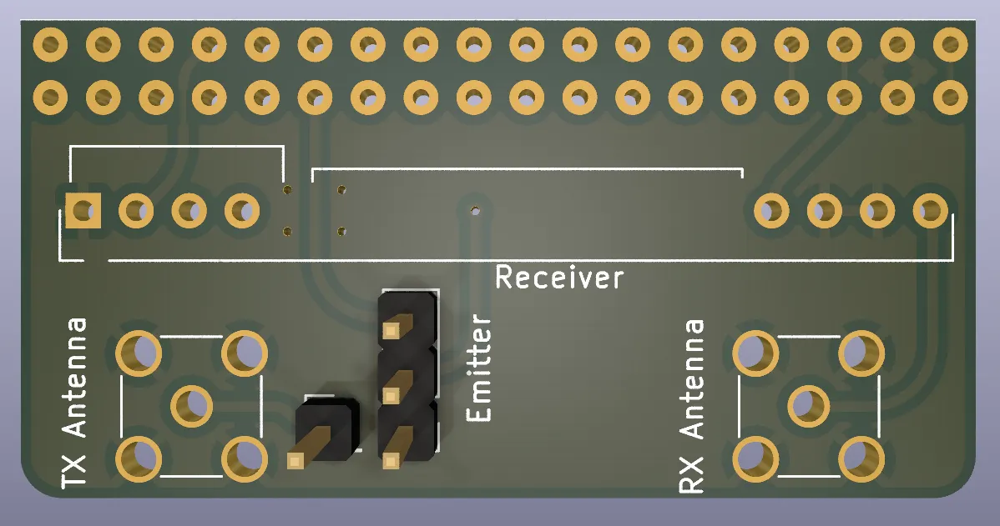

# RFXCom PCB

This PCB aims to replace wires in a RFXCom project using:
* an Arduino Mega 2560
* a RXB6 Super Heterodyne receiver
* a XD-FST FS1000A emitter

(See https://opendomotech.com/fabriquer-rflink-alternative-diy-du-rfxcom/)

